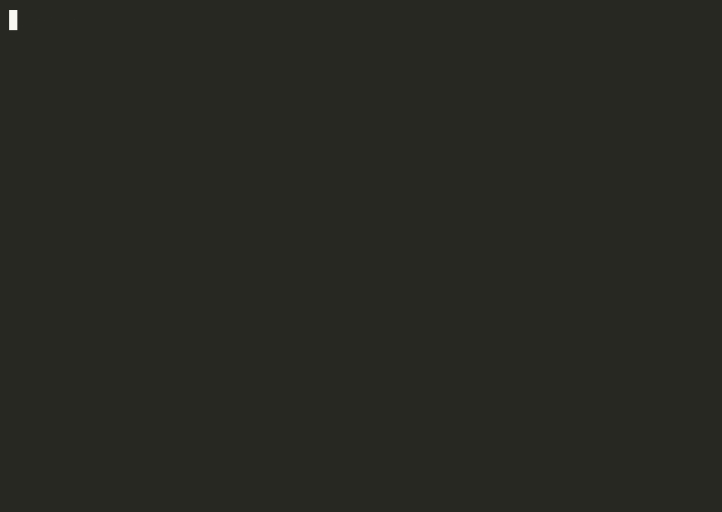

# Unix Shell (C++)

A minimal Unix-like interactive shell implemented in C++ using POSIX system calls.

## Demo



---

## Overview

This shell provides:

- Interactive command input with history (arrow keys)
- Execution of external programs using `fork()` and `execvp()`
- Input (`<`) and output (`>`) redirection
- Command pipelines using `|`
- Built-in `cd` command
- Graceful exit via `exit`, `quit`, or Ctrl+D

The goal of this project is to demonstrate understanding of process creation, system calls, and Unix file descriptor handling.

---

## Features

### Process Execution
- Creates child processes using `fork()`
- Executes programs using `execvp()`
- Forks all pipeline children before waiting to avoid deadlock

### Input / Output Redirection
- Supports output redirection using `>`
- Supports input redirection using `<`
- Supports combined redirection: `nl < input.txt > output.txt`
- Uses `open()` and `dup2()` to redirect file descriptors

### Pipeline Support
- Connects multiple commands using `|`
- Implements inter-process communication using `pipe()`
- Wires file descriptors between adjacent commands

Example:
```bash
ls -l | grep txt > output.txt
```

### Built-in Commands
- `cd` implemented using `chdir()`, supports `$HOME`
- `exit` / `quit` to terminate the shell

---

## Build

Requires GNU readline (`brew install readline` on macOS).

```bash
make
```

## Usage

```bash
./UnixShell
```

### Example commands

```
myshell> ls
myshell> ls | nl
myshell> cat < shelpers.cpp | wc -l
myshell> cat shelpers.cpp | nl | head -50 | tail -10
myshell> cat shelpers.cpp | nl | head -50 | tail -10 > ten_lines.txt
myshell> nl < data.txt > numbered.txt
myshell> cd /tmp
myshell> exit
```

---

## Project Structure

| File | Description |
|------|-------------|
| `main.cpp` | Main shell loop: fork/exec, pipe management, I/O redirect |
| `shelpers.cpp` | Tokenizer and `getCommands()` parser |
| `shelpers.h` | `Command` struct and function declarations |
| `Makefile` | Build configuration |

---

## How It Works

1. The shell reads user input interactively via readline.
2. Input is tokenized and parsed into `Command` structs.
3. If the command is `cd`, it is handled as a built-in.
4. For external commands:
   - All child processes are forked first
   - Each child sets up redirection or pipe connections using `dup2()`
   - Each child calls `execvp()` to execute the program
   - The parent closes its pipe fd copies, then waits for all children

---

## Skills Demonstrated

- Process management using `fork()` and `execvp()`
- Inter-process communication with `pipe()`
- File descriptor manipulation via `dup2()`
- I/O redirection handling
- Pipe deadlock prevention
- Basic command parsing and tokenization
- POSIX system-level programming

---

## Tech Stack

- C++11
- POSIX system calls
- GNU readline
- Unix file descriptor model

---

## Author

Yuyao Tu — CS 6013 Systems I
